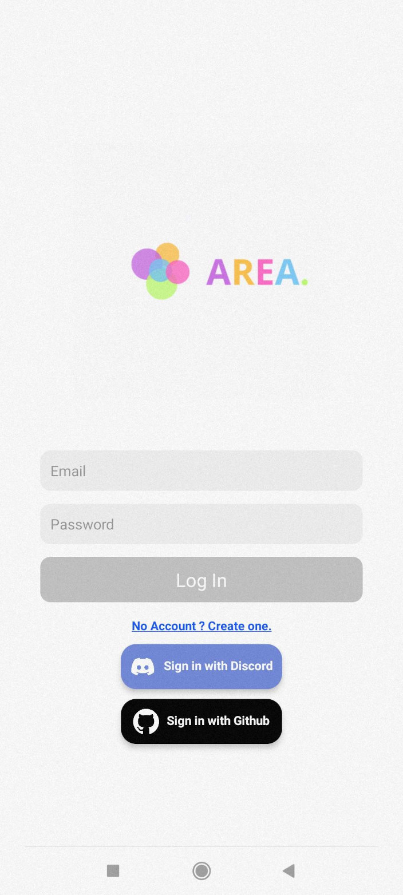
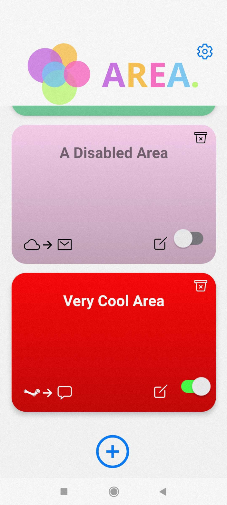
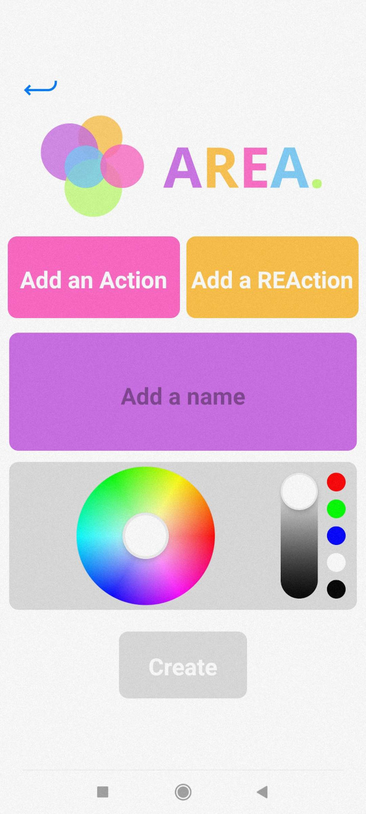
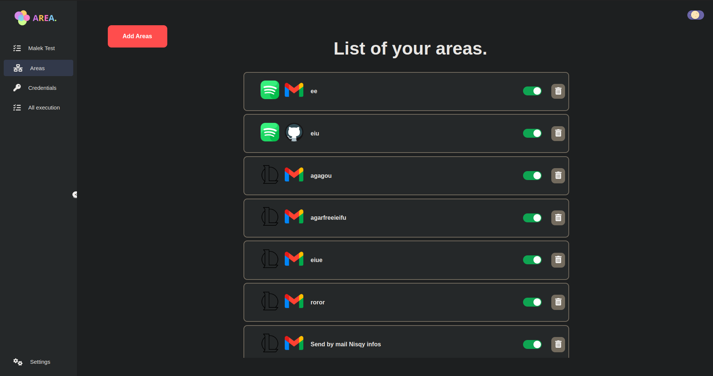
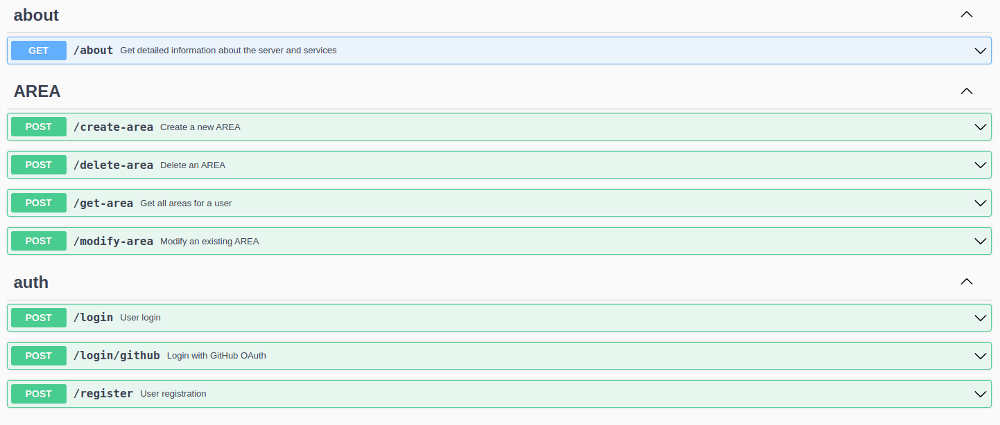

# Area

## Project overview: 

The AREA project consists in the creation of a software suite that functions similarly to IFTTT and/or Zapier.  
This software suite is a divided into 3 parts:
- A server to implement all the features.
- A web application to use the app from a browser.
- A mobile application to use the app from a phone.

## Languages:  
This project was developped using the following languages:  

- Server → Nginx
- Database → PostgreSql.
- Web application → VueJs.  
- Mobile application → React Native. 
- Backend → Gin.  
  
## Documentation:  
In the `documentation/` folder you can find these documents:  
- User's guide → How to use the application.  
- Technical documentation → Technical information about the project.  

## Achievement:    

### Mobile app:  

  
### Web app:  

![image]in progress

## Services:  

Here are all the different actions/reactions that you can use:  
- Gmail:  
  - Send an email.
- Github:
  - New Push.
  - Fill a file in AREA repo on github with information (Need AREA repo).
  - New repository created.
- Timer:
  - Fire the reaction at this time.
  - Trigger at equal interval.
- Discord
  - send a private message to user
- League of legends
  - Game lunch by user
  - New Rank
  - New level
- Spotify
  - New song is released.
  - New Album artist.
- Weather
  - Provide daily weather to user.
- Teamfight Tactics
  - New lose.
  - New win.
  - New rank.
- Steam
  - Cs update.
  - tf2 update.
  - dota update.
  - cs monthly player count.
  
## API endpoints:  
 
